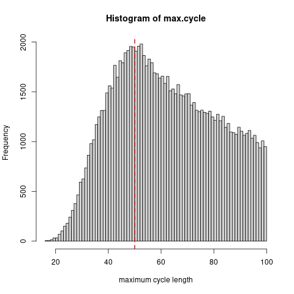
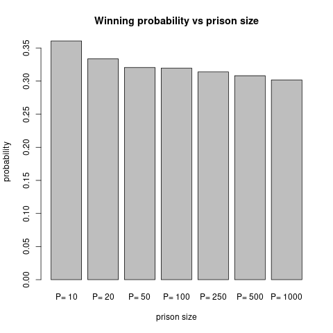

# 100-Prisoners Problem

Simulation of the 100 prisoners problem in R.

The 100 prisoners problem is a mathematical problem in probability
theory and combinatorics. In this problem, 100 numbered prisoners
must find their own numbers in one of 100 drawers in order to
survive. The rules state that each prisoner may open only 50
drawers and cannot communicate with other prisoners. At first
glance, the situation appears hopeless, but a clever strategy
offers the prisoners a realistic chance of survival. Danish
computer scientist Peter Bro Miltersen first proposed the problem
in 2003.

This R script implements the "follow-the-box" strategy, shows the linked boxes as a graph 
and computes the probability distribution of the maximum cycle length.

For more details: https://en.wikipedia.org/wiki/100_prisoners_problem
For the solution, see for example: https://www.youtube.com/watch?v=iSNsgj1OCLA (Veritasium)

